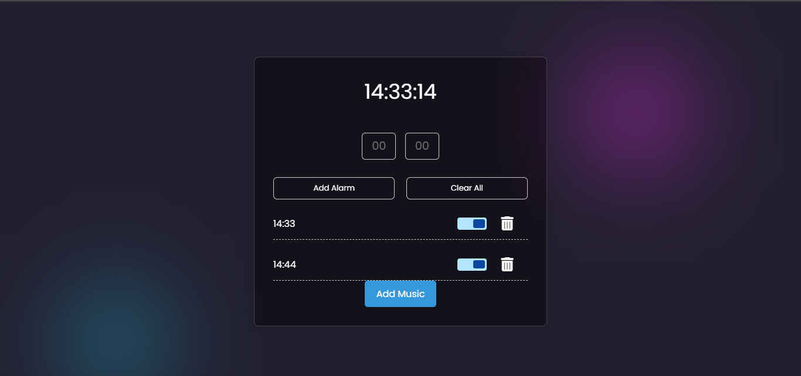

# Alarm App

A simple web-based alarm application with the ability to add alarms and customize notification sounds.



## Table of Contents

- [Features](#features)
- [Getting Started](#getting-started)
- [Usage](#usage)
- [File Structure](#file-structure)
- [Contributing](#contributing)
- [License](#license)

## Features

- Set alarms for specific times.
- Customize notification sounds with your own music files.
- Clear all alarms with one click.

## Getting Started

To run the application locally, follow these steps:

1. Clone the repository:

   ```bash
   git clone https://github.com/MohcineSafi/alarm-app.git

2. Navigate to the project directory:

    cd alarm-app

3. Open the index.html file in your preferred web browser.

## Usage

1. Enter the hour and minute for your alarm.
2. Click the "Add Alarm" button.
3. Optionally, upload your own music file by clicking the "Add Music" button.
4. To clear all alarms, click the "Clear All" button.

## File Structure

1. index.html: Main HTML file.
1. style.css: Stylesheet for the application.
1. script.js: JavaScript file containing the application logic.
1. README.md: Documentation.

## Contributing

Contributions are welcome! Fork the repository and create a pull request with your improvements.

## License

This project is licensed under the MIT License.
